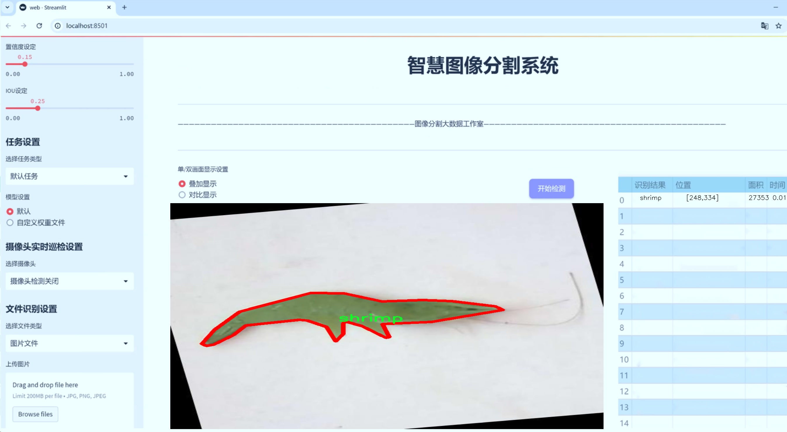
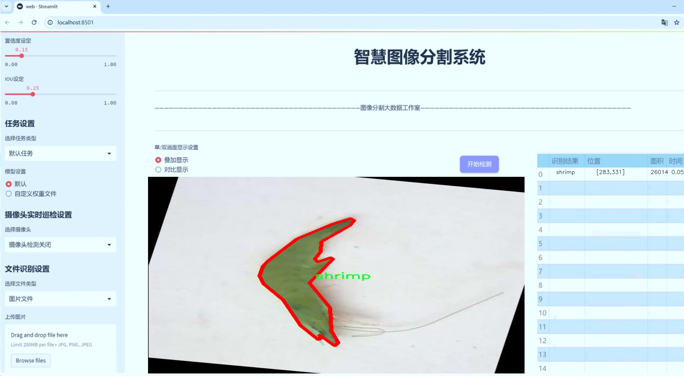
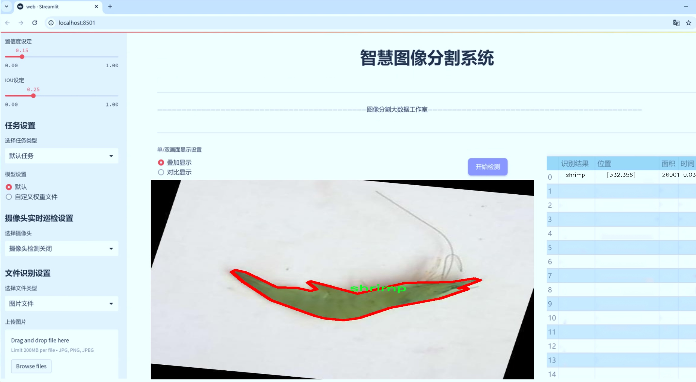
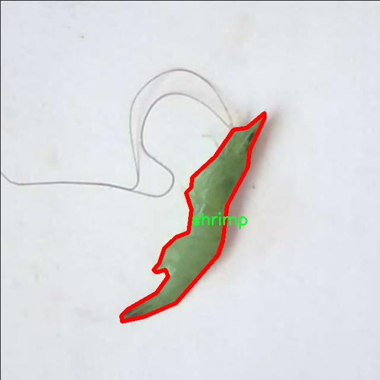
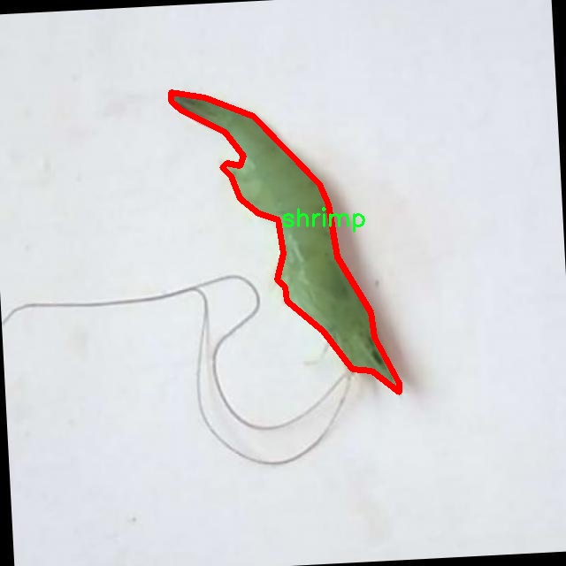
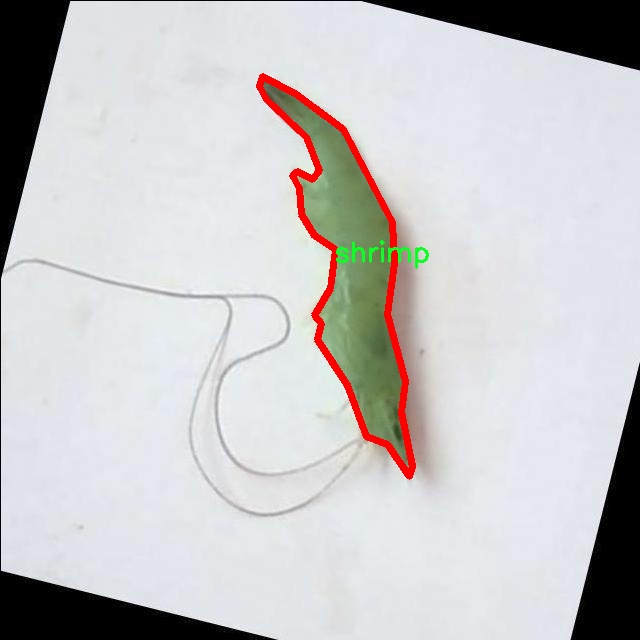
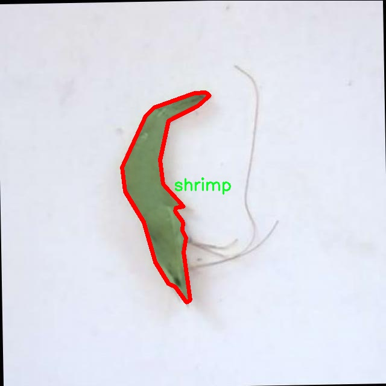
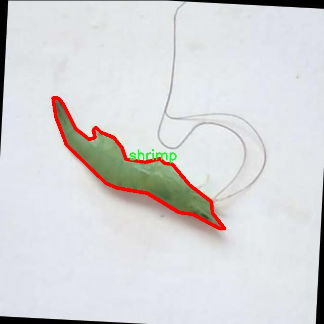

# 海鲜图像分割系统源码＆数据集分享
 [yolov8-seg-C2f-DAttention＆yolov8-seg-C2f-SCcConv等50+全套改进创新点发刊_一键训练教程_Web前端展示]

### 1.研究背景与意义

项目参考[ILSVRC ImageNet Large Scale Visual Recognition Challenge](https://gitee.com/YOLOv8_YOLOv11_Segmentation_Studio/projects)

项目来源[AAAI Global Al lnnovation Contest](https://kdocs.cn/l/cszuIiCKVNis)

研究背景与意义

随着全球经济的快速发展和人们生活水平的提高，海鲜作为一种营养丰富且美味的食品，逐渐成为了人们日常饮食中不可或缺的一部分。然而，海鲜的种类繁多，形态各异，如何准确、快速地识别和分割不同种类的海鲜图像，成为了食品安全、质量控制及市场监管等领域亟待解决的问题。传统的图像处理方法在处理复杂背景和多样化海鲜图像时，往往面临着准确率低、处理速度慢等局限性。因此，基于深度学习的图像分割技术应运而生，成为解决这一问题的重要手段。

YOLO（You Only Look Once）系列模型因其高效的实时目标检测能力而广受欢迎。YOLOv8作为该系列的最新版本，结合了多种先进的深度学习技术，具备了更强的特征提取能力和更高的检测精度。然而，尽管YOLOv8在目标检测方面表现优异，但在海鲜图像的实例分割任务中，仍然存在一定的改进空间。针对这一问题，本文提出了一种基于改进YOLOv8的海鲜图像分割系统，旨在提高海鲜图像的分割精度和处理效率。

本研究所使用的数据集包含7100张海鲜图像，涵盖了四个主要类别：area、object、prawn和shrimp。这些类别不仅代表了海鲜的不同种类，还反映了海鲜在不同环境下的多样性。通过对这些图像进行深度学习训练，模型能够学习到不同海鲜的特征，从而实现更为精准的分割。数据集的丰富性和多样性为模型的训练提供了良好的基础，使得改进后的YOLOv8能够在复杂背景下仍然保持较高的分割精度。

本研究的意义在于，通过改进YOLOv8模型，推动海鲜图像分割技术的发展，为海鲜产业的智能化和自动化提供技术支持。首先，精准的海鲜图像分割能够有效提高海鲜质量检测的效率，帮助商家和消费者更好地识别和选择优质海鲜，进而提升食品安全水平。其次，该技术的应用可以促进海鲜市场的透明化，减少因海鲜品质问题引发的纠纷，维护消费者的合法权益。此外，改进后的分割系统还可以为海洋生物研究提供数据支持，助力生态保护和可持续发展。

综上所述，基于改进YOLOv8的海鲜图像分割系统不仅具有重要的学术价值，还有着广泛的应用前景。通过本研究的深入探索，期望能够为海鲜图像处理领域带来新的思路和方法，推动相关技术的进步与应用，为海鲜产业的健康发展贡献力量。

### 2.图片演示







##### 注意：由于此博客编辑较早，上面“2.图片演示”和“3.视频演示”展示的系统图片或者视频可能为老版本，新版本在老版本的基础上升级如下：（实际效果以升级的新版本为准）

  （1）适配了YOLOV8的“目标检测”模型和“实例分割”模型，通过加载相应的权重（.pt）文件即可自适应加载模型。

  （2）支持“图片识别”、“视频识别”、“摄像头实时识别”三种识别模式。

  （3）支持“图片识别”、“视频识别”、“摄像头实时识别”三种识别结果保存导出，解决手动导出（容易卡顿出现爆内存）存在的问题，识别完自动保存结果并导出到tempDir中。

  （4）支持Web前端系统中的标题、背景图等自定义修改，后面提供修改教程。

  另外本项目提供训练的数据集和训练教程,暂不提供权重文件（best.pt）,需要您按照教程进行训练后实现图片演示和Web前端界面演示的效果。

### 3.视频演示

[3.1 视频演示](https://www.bilibili.com/video/BV1bgDJYvEuQ/)

### 4.数据集信息展示

##### 4.1 本项目数据集详细数据（类别数＆类别名）

nc: 1
names: ['shrimp']


##### 4.2 本项目数据集信息介绍

数据集信息展示

在本研究中，我们使用的数据集名为“0702241217”，其专门用于训练和改进YOLOv8-seg的海鲜图像分割系统。该数据集的设计旨在提升模型在海鲜图像分割任务中的表现，尤其是针对虾类的精确识别与分割。数据集的类别数量为1，具体类别为“shrimp”，这意味着所有的图像均围绕这一特定海鲜种类展开，确保了数据集的专一性和针对性。

“0702241217”数据集包含了多种不同环境下的虾类图像，这些图像不仅涵盖了虾的不同种类、大小和形态，还包括了在不同光照条件、背景和水域环境下的虾类图像。这种多样性使得模型在训练过程中能够学习到更加丰富的特征，从而提高其在实际应用中的鲁棒性和准确性。数据集中的图像经过精心挑选和标注，确保每一张图像都能为模型提供有价值的信息，尤其是在分割任务中，准确的标注是提升模型性能的关键。

为了实现高效的图像分割，数据集中的每一张图像都配备了相应的掩膜（mask），这些掩膜精确地勾勒出虾的轮廓，使得模型能够在训练过程中有效地学习到虾的形状特征。通过这种方式，YOLOv8-seg模型不仅能够识别出图像中的虾类，还能够准确地分割出虾的具体区域，从而为后续的图像分析和处理提供可靠的基础。

在数据集的构建过程中，我们还特别考虑了数据的平衡性和多样性。尽管数据集的类别数量仅为1，但我们确保在样本数量和图像质量上都达到了较高的标准。这种做法不仅有助于提升模型的训练效果，还能有效避免过拟合现象的发生，使得模型在面对未见过的图像时，依然能够保持良好的性能。

此外，数据集“0702241217”还为后续的研究提供了丰富的实验基础。研究人员可以在此基础上进行各种模型的比较与分析，探索不同算法在海鲜图像分割任务中的表现。这种开放性和可扩展性为未来的研究提供了更多的可能性，使得该数据集不仅仅是一个简单的训练工具，更是推动海鲜图像处理领域发展的重要资源。

总之，数据集“0702241217”以其专一的类别设置、丰富的图像样本和精确的标注，为改进YOLOv8-seg的海鲜图像分割系统提供了坚实的基础。通过对该数据集的深入研究与应用，我们期待能够在海鲜图像分割领域取得更为显著的进展，推动相关技术的进一步发展。











### 5.全套项目环境部署视频教程（零基础手把手教学）

[5.1 环境部署教程链接（零基础手把手教学）](https://www.bilibili.com/video/BV1jG4Ve4E9t/?vd_source=bc9aec86d164b67a7004b996143742dc)


[5.2 安装Python虚拟环境创建和依赖库安装视频教程链接（零基础手把手教学）](https://www.bilibili.com/video/BV1nA4VeYEze/?vd_source=bc9aec86d164b67a7004b996143742dc)

### 6.手把手YOLOV8-seg训练视频教程（零基础小白有手就能学会）

[6.1 手把手YOLOV8-seg训练视频教程（零基础小白有手就能学会）](https://www.bilibili.com/video/BV1cA4VeYETe/?vd_source=bc9aec86d164b67a7004b996143742dc)


按照上面的训练视频教程链接加载项目提供的数据集，运行train.py即可开始训练



     Epoch   gpu_mem       box       obj       cls    labels  img_size
     1/200     0G   0.01576   0.01955  0.007536        22      1280: 100%|██████████| 849/849 [14:42<00:00,  1.04s/it]
               Class     Images     Labels          P          R     mAP@.5 mAP@.5:.95: 100%|██████████| 213/213 [01:14<00:00,  2.87it/s]
                 all       3395      17314      0.994      0.957      0.0957      0.0843

     Epoch   gpu_mem       box       obj       cls    labels  img_size
     2/200     0G   0.01578   0.01923  0.007006        22      1280: 100%|██████████| 849/849 [14:44<00:00,  1.04s/it]
               Class     Images     Labels          P          R     mAP@.5 mAP@.5:.95: 100%|██████████| 213/213 [01:12<00:00,  2.95it/s]
                 all       3395      17314      0.996      0.956      0.0957      0.0845

     Epoch   gpu_mem       box       obj       cls    labels  img_size
     3/200     0G   0.01561    0.0191  0.006895        27      1280: 100%|██████████| 849/849 [10:56<00:00,  1.29it/s]
               Class     Images     Labels          P          R     mAP@.5 mAP@.5:.95: 100%|███████   | 187/213 [00:52<00:00,  4.04it/s]
                 all       3395      17314      0.996      0.957      0.0957      0.0845


### 7.50+种全套YOLOV8-seg创新点代码加载调参视频教程（一键加载写好的改进模型的配置文件）

[7.1 50+种全套YOLOV8-seg创新点代码加载调参视频教程（一键加载写好的改进模型的配置文件）](https://www.bilibili.com/video/BV1Hw4VePEXv/?vd_source=bc9aec86d164b67a7004b996143742dc)

### 8.YOLOV8-seg图像分割算法原理

原始YOLOV8-seg算法原理

YOLOv8-seg算法是Ultralytics在2023年推出的最新目标检测和图像分割模型，代表了YOLO系列算法的又一次重大进步。作为YOLO系列的延续，YOLOv8-seg不仅继承了前几代模型的优点，还在网络结构、损失函数和特征提取等多个方面进行了创新和优化。该算法的设计理念是追求高效、准确和实时性，旨在满足现代计算机视觉任务的需求。

YOLOv8-seg的网络结构主要分为四个部分：输入端、骨干网络、颈部网络和头部网络。输入端负责数据的预处理，包括图像的缩放、增强和填充等操作。YOLOv8-seg在输入端采用了马赛克（Mosaic）数据增强技术，这种方法通过将多张图像拼接在一起，生成新的训练样本，迫使模型学习到不同的上下文信息，从而提高模型的泛化能力和预测精度。输入图像的尺寸通常设定为640x640，但为了适应不同长宽比的图像，YOLOv8-seg在推理阶段采用自适应缩放策略，以减少信息冗余并提高处理速度。

在骨干网络部分，YOLOv8-seg引入了C2f模块，这一模块的设计灵感来源于YOLOv7的ELAN结构。C2f模块通过并行的梯度流分支，增强了特征提取的能力，能够更好地捕捉图像中的细节信息。与之前的C3模块相比，C2f模块在保持轻量化的同时，提供了更丰富的梯度流信息，从而显著提升了模型的性能。此外，YOLOv8-seg还采用了空间金字塔池化融合（SPPF）结构，进一步增强了对多尺度特征的提取能力，使得模型在处理不同大小的目标时表现更加出色。

颈部网络部分则采用了路径聚合网络（PAN）结构，旨在加强不同尺度特征的融合能力。PAN通过对不同层次的特征进行聚合，使得模型能够更好地理解图像中的上下文信息，从而提升对目标的检测和分割精度。YOLOv8-seg在这一部分的设计上，充分考虑了目标在不同尺度下的特征表现，使得模型在面对复杂场景时，依然能够保持较高的准确性。

头部网络是YOLOv8-seg中变化最大的部分，主要体现在分类和检测过程的解耦设计上。传统的YOLO模型通常将分类和检测过程耦合在一起，而YOLOv8-seg则将其分开，采用解耦头结构。这一结构使得模型在处理分类和回归任务时，能够更加高效地进行特征学习。具体而言，YOLOv8-seg在头部网络中使用了无锚框（Anchor-Free）检测方法，取代了传统的锚框方法。这一创新使得模型不再依赖于预设的锚框位置和大小，从而提高了检测的灵活性和准确性。

在损失函数的设计上，YOLOv8-seg采用了多种损失计算策略，以确保模型在训练过程中能够快速收敛。分类分支使用了二元交叉熵损失（BCELoss），而回归分支则结合了分布焦点损失（DFLoss）和完全交并比损失（CIOULoss），以提升边界框预测的精准性。这种损失函数的组合设计，使得模型在处理复杂场景时，能够更好地聚焦于目标的真实位置，提高了检测的准确性。

总的来说，YOLOv8-seg算法通过一系列创新的设计和优化，显著提升了目标检测和图像分割的性能。其高效的网络结构、灵活的损失函数以及无锚框的检测方法，使得YOLOv8-seg在实时检测领域达到了新的高度。随着这一算法的推广和应用，预计将对目标检测和计算机视觉领域产生深远的影响，推动相关技术的进一步发展。在实际应用中，YOLOv8-seg被广泛应用于农业、自动驾驶、安防监控等多个领域，展现出强大的视觉识别能力和应用潜力。通过结合其他算法，如蚁群算法进行路径规划，YOLOv8-seg在自动化作业中也展现出了良好的适应性和实用性，为智能化的未来奠定了基础。


### 9.系统功能展示（检测对象为举例，实际内容以本项目数据集为准）

图9.1.系统支持检测结果表格显示

  图9.2.系统支持置信度和IOU阈值手动调节

  图9.3.系统支持自定义加载权重文件best.pt(需要你通过步骤5中训练获得)

  图9.4.系统支持摄像头实时识别

  图9.5.系统支持图片识别

  图9.6.系统支持视频识别

  图9.7.系统支持识别结果文件自动保存

  图9.8.系统支持Excel导出检测结果数据


### 10.50+种全套YOLOV8-seg创新点原理讲解（非科班也可以轻松写刊发刊，V11版本正在科研待更新）

#### 10.1 由于篇幅限制，每个创新点的具体原理讲解就不一一展开，具体见下列网址中的创新点对应子项目的技术原理博客网址【Blog】：


[10.1 50+种全套YOLOV8-seg创新点原理讲解链接](https://gitee.com/qunmasj/good)

#### 10.2 部分改进模块原理讲解(完整的改进原理见上图和技术博客链接)【如果此小节的图加载失败可以通过CSDN或者Github搜索该博客的标题访问原始博客，原始博客图片显示正常】
### CBAM空间注意力机制
近年来，随着深度学习研究方向的火热，注意力机制也被广泛地应用在图像识别、语音识别和自然语言处理等领域，注意力机制在深度学习任务中发挥着举足轻重的作用。注意力机制借鉴于人类的视觉系统，例如，人眼在看到一幅画面时，会倾向于关注画面中的重要信息，而忽略其他可见的信息。深度学习中的注意力机制和人类视觉的注意力机制相似，通过扫描全局数据，从大量数据中选择出需要重点关注的、对当前任务更为重要的信息，然后对这部分信息分配更多的注意力资源，从这些信息中获取更多所需要的细节信息，而抑制其他无用的信息。而在深度学习中，则具体表现为给感兴趣的区域更高的权重，经过网络的学习和调整，得到最优的权重分配，形成网络模型的注意力，使网络拥有更强的学习能力，加快网络的收敛速度。
注意力机制通常可分为软注意力机制和硬注意力机制[4-5]。软注意力机制在选择信息时，不是从输入的信息中只选择1个，而会用到所有输入信息，只是各个信息对应的权重分配不同，然后输入网络模型进行计算;硬注意力机制则是从输入的信息中随机选取一个或者选择概率最高的信息，但是这一步骤通常是不可微的，导致硬注意力机制更难训练。因此，软注意力机制应用更为广泛，按照原理可将软注意力机制划分为:通道注意力机制（channel attention)、空间注意力机制(spatial attention）和混合域注意力机制(mixed attention)。
通道注意力机制的本质建立各个特征通道之间的重要程度，对感兴趣的通道进行重点关注，弱化不感兴趣的通道的作用;空间注意力的本质则是建模了整个空间信息的重要程度，然后对空间内感兴趣的区域进行重点关注，弱化其余非感兴趣区域的作用;混合注意力同时运用了通道注意力和空间注意力，两部分先后进行或并行，形成对通道特征和空间特征同时关注的注意力模型。

卷积层注意力模块(Convolutional Block Attention Module，CBAM）是比较常用的混合注意力模块，其先后集中了通道注意力模块和空间注意力模块，网络中加入该模块能有效提高网络性能，减少网络模型的计算量，模块结构如图所示。输入特征图首先经过分支的通道注意力模块，然后和主干的原特征图融合，得到具有通道注意力的特征图，接着经过分支的空间注意力模块，在和主干的特征图融合后，得到同时具有通道特征注意力和空间特征注意力的特征图。CBAM模块不改变输入特征图的大小，因此该模块是一个“即插即用”的模块，可以插入网络的任何位置。

通道注意力模块的结构示意图如图所示，通道注意力模块分支并行地对输入的特征图进行最大池化操作和平均池化操作，然后利用多层感知机对结果进行变换，得到应用于两个通道的变换结果，最后经过sigmoid激活函数将变换结果融合，得到具有通道注意力的通道特征图。

空间注意力模块示意图如图所示，将通道注意力模块输出的特征图作为该模块的输入特征图，首先对输入特征图进行基于通道的最大池化操作和平均池化操作，将两部分得到的结果拼接起来，然后通过卷积得到降为Ⅰ通道的特征图，最后通过sigmoid激活函数生成具有空间注意力的特征图。


### 11.项目核心源码讲解（再也不用担心看不懂代码逻辑）

#### 11.1 ultralytics\solutions\ai_gym.py

以下是经过简化和注释的核心代码部分，保留了主要功能并对每个部分进行了详细的中文注释：

```python
import cv2
from ultralytics.utils.plotting import Annotator

class AIGym:
    """管理实时视频流中人们的健身动作的类。"""

    def __init__(self):
        """初始化AIGym，设置默认的视觉和图像参数。"""
        self.im0 = None  # 当前帧图像
        self.tf = None   # 线条厚度
        self.keypoints = None  # 关键点数据
        self.poseup_angle = None  # 动作上升角度
        self.posedown_angle = None  # 动作下降角度
        self.angle = None  # 当前角度
        self.count = None  # 动作计数
        self.stage = None  # 当前阶段（上升或下降）
        self.pose_type = 'pushup'  # 动作类型（如俯卧撑）
        self.kpts_to_check = None  # 用于计数的关键点
        self.view_img = False  # 是否显示图像
        self.annotator = None  # 注释工具

    def set_args(self, kpts_to_check, line_thickness=2, view_img=False, pose_up_angle=145.0, pose_down_angle=90.0, pose_type='pullup'):
        """
        配置AIGym的参数
        Args:
            kpts_to_check (list): 用于计数的3个关键点
            line_thickness (int): 边框线条的厚度
            view_img (bool): 是否显示图像
            pose_up_angle (float): 动作上升的角度阈值
            pose_down_angle (float): 动作下降的角度阈值
            pose_type (str): 动作类型（如俯卧撑、引体向上或腹部锻炼）
        """
        self.kpts_to_check = kpts_to_check
        self.tf = line_thickness
        self.view_img = view_img
        self.poseup_angle = pose_up_angle
        self.posedown_angle = pose_down_angle
        self.pose_type = pose_type

    def start_counting(self, im0, results, frame_count):
        """
        计数健身动作的函数
        Args:
            im0 (ndarray): 当前视频帧
            results: 姿态估计数据
            frame_count: 当前帧计数
        """
        self.im0 = im0  # 保存当前帧图像
        if frame_count == 1:
            # 初始化计数和角度
            self.count = [0] * len(results[0])
            self.angle = [0] * len(results[0])
            self.stage = ['-' for _ in results[0]]
        
        self.keypoints = results[0].keypoints.data  # 获取关键点数据
        self.annotator = Annotator(im0, line_width=2)  # 初始化注释工具

        # 遍历每个关键点
        for ind, k in enumerate(reversed(self.keypoints)):
            # 计算姿态角度
            self.angle[ind] = self.annotator.estimate_pose_angle(
                k[int(self.kpts_to_check[0])].cpu(),
                k[int(self.kpts_to_check[1])].cpu(),
                k[int(self.kpts_to_check[2])].cpu()
            )
            # 绘制关键点
            self.im0 = self.annotator.draw_specific_points(k, self.kpts_to_check, shape=(640, 640), radius=10)

            # 根据动作类型更新计数和阶段
            if self.pose_type == 'pushup':
                self.update_count_pushup(ind)
            elif self.pose_type == 'pullup':
                self.update_count_pullup(ind)
            elif self.pose_type == 'abworkout':
                self.update_count_abworkout(ind)

            # 绘制角度、计数和阶段信息
            self.annotator.plot_angle_and_count_and_stage(
                angle_text=self.angle[ind],
                count_text=self.count[ind],
                stage_text=self.stage[ind],
                center_kpt=k[int(self.kpts_to_check[1])],
                line_thickness=self.tf
            )

            # 绘制所有关键点
            self.annotator.kpts(k, shape=(640, 640), radius=1, kpt_line=True)

        # 如果需要显示图像
        if self.view_img:
            cv2.imshow('Ultralytics YOLOv8 AI GYM', self.im0)
            if cv2.waitKey(1) & 0xFF == ord('q'):
                return

    def update_count_pushup(self, ind):
        """更新俯卧撑的计数和阶段"""
        if self.angle[ind] > self.poseup_angle:
            self.stage[ind] = 'up'
        if self.angle[ind] < self.posedown_angle and self.stage[ind] == 'up':
            self.stage[ind] = 'down'
            self.count[ind] += 1

    def update_count_pullup(self, ind):
        """更新引体向上的计数和阶段"""
        if self.angle[ind] > self.poseup_angle:
            self.stage[ind] = 'down'
        if self.angle[ind] < self.posedown_angle and self.stage[ind] == 'down':
            self.stage[ind] = 'up'
            self.count[ind] += 1

    def update_count_abworkout(self, ind):
        """更新腹部锻炼的计数和阶段"""
        if self.angle[ind] > self.poseup_angle:
            self.stage[ind] = 'down'
        if self.angle[ind] < self.posedown_angle and self.stage[ind] == 'down':
            self.stage[ind] = 'up'
            self.count[ind] += 1

if __name__ == '__main__':
    AIGym()  # 实例化AIGym类
```

### 代码说明：
1. **类的初始化**：`__init__` 方法中初始化了一些用于图像处理和动作计数的参数。
2. **参数设置**：`set_args` 方法用于配置关键点、线条厚度、是否显示图像等参数。
3. **计数逻辑**：`start_counting` 方法中包含了核心的计数逻辑，计算每个关键点的角度并根据动作类型更新计数和阶段。
4. **动作更新**：分别定义了 `update_count_pushup`、`update_count_pullup` 和 `update_count_abworkout` 方法，用于更新不同类型动作的计数和阶段。
5. **图像显示**：如果设置了显示图像，则使用 OpenCV 显示当前帧。

通过这种方式，代码的结构更加清晰，功能模块化，便于后续的维护和扩展。

这个文件定义了一个名为 `AIGym` 的类，主要用于在实时视频流中管理基于人体姿态的健身动作计数。该类的设计目的是通过姿态估计来识别和计数用户在进行特定健身动作（如俯卧撑、引体向上或腹部锻炼）时的动作。

在 `__init__` 方法中，类的实例被初始化，设置了一些默认值，包括图像参数、关键点信息、角度、计数、阶段和姿态类型等。这里还定义了一个阈值 `threshold`，用于后续的计算。

`set_args` 方法用于配置一些参数，包括需要检查的关键点、线条厚度、是否显示图像、上举和下放的角度阈值，以及姿态类型。这个方法允许用户根据需要自定义这些参数，以适应不同的健身动作。

`start_counting` 方法是核心功能，用于处理每一帧图像并进行动作计数。它接收当前帧图像、姿态估计结果和帧计数作为输入。首先，它会在第一次调用时初始化计数、角度和阶段的存储列表。然后，它提取关键点数据，并使用 `Annotator` 类来进行可视化处理。

在循环中，程序会根据不同的姿态类型（俯卧撑、引体向上、腹部锻炼）来计算角度，并判断当前的动作阶段（上、下）。如果动作阶段发生变化，计数器会相应增加。每个关键点的角度、计数和阶段信息会被绘制到图像上，以便于实时查看。

最后，如果设置了 `view_img` 为真，程序会使用 OpenCV 显示处理后的图像，并允许用户通过按下 'q' 键退出显示。

整个类的设计使得用户能够实时监控自己的健身动作，并通过姿态估计技术进行有效的动作计数和反馈。

#### 11.2 ultralytics\trackers\utils\matching.py

以下是代码中最核心的部分，并附上详细的中文注释：

```python
import numpy as np
import scipy
from scipy.spatial.distance import cdist
from ultralytics.utils.metrics import bbox_ioa

try:
    import lap  # 导入线性分配库
    assert lap.__version__  # 确保导入的包不是目录
except (ImportError, AssertionError, AttributeError):
    from ultralytics.utils.checks import check_requirements
    check_requirements('lapx>=0.5.2')  # 检查并更新到 lap 包
    import lap

def linear_assignment(cost_matrix, thresh, use_lap=True):
    """
    使用线性分配算法进行匹配。

    参数:
        cost_matrix (np.ndarray): 包含分配成本的矩阵。
        thresh (float): 认为分配有效的阈值。
        use_lap (bool, optional): 是否使用 lap.lapjv。默认为 True。

    返回:
        (tuple): 包含匹配索引、未匹配的 'a' 索引和未匹配的 'b' 索引的元组。
    """
    if cost_matrix.size == 0:
        # 如果成本矩阵为空，返回空匹配和所有未匹配索引
        return np.empty((0, 2), dtype=int), tuple(range(cost_matrix.shape[0])), tuple(range(cost_matrix.shape[1]))

    if use_lap:
        # 使用 lap 库进行线性分配
        _, x, y = lap.lapjv(cost_matrix, extend_cost=True, cost_limit=thresh)
        matches = [[ix, mx] for ix, mx in enumerate(x) if mx >= 0]  # 生成匹配对
        unmatched_a = np.where(x < 0)[0]  # 找到未匹配的 'a' 索引
        unmatched_b = np.where(y < 0)[0]  # 找到未匹配的 'b' 索引
    else:
        # 使用 scipy 进行线性分配
        x, y = scipy.optimize.linear_sum_assignment(cost_matrix)  # 获取匹配索引
        matches = np.asarray([[x[i], y[i]] for i in range(len(x)) if cost_matrix[x[i], y[i]] <= thresh])
        if len(matches) == 0:
            unmatched_a = list(np.arange(cost_matrix.shape[0]))  # 所有 'a' 索引未匹配
            unmatched_b = list(np.arange(cost_matrix.shape[1]))  # 所有 'b' 索引未匹配
        else:
            unmatched_a = list(set(np.arange(cost_matrix.shape[0])) - set(matches[:, 0]))  # 找到未匹配的 'a'
            unmatched_b = list(set(np.arange(cost_matrix.shape[1])) - set(matches[:, 1]))  # 找到未匹配的 'b'

    return matches, unmatched_a, unmatched_b  # 返回匹配和未匹配索引

def iou_distance(atracks, btracks):
    """
    基于交并比 (IoU) 计算轨迹之间的成本。

    参数:
        atracks (list[STrack] | list[np.ndarray]): 轨迹 'a' 或边界框的列表。
        btracks (list[STrack] | list[np.ndarray]): 轨迹 'b' 或边界框的列表。

    返回:
        (np.ndarray): 基于 IoU 计算的成本矩阵。
    """
    if (len(atracks) > 0 and isinstance(atracks[0], np.ndarray)) \
            or (len(btracks) > 0 and isinstance(btracks[0], np.ndarray)):
        atlbrs = atracks  # 直接使用边界框
        btlbrs = btracks
    else:
        atlbrs = [track.tlbr for track in atracks]  # 从轨迹中提取边界框
        btlbrs = [track.tlbr for track in btracks]

    ious = np.zeros((len(atlbrs), len(btlbrs)), dtype=np.float32)  # 初始化 IoU 矩阵
    if len(atlbrs) and len(btlbrs):
        # 计算 IoU
        ious = bbox_ioa(np.ascontiguousarray(atlbrs, dtype=np.float32),
                        np.ascontiguousarray(btlbrs, dtype=np.float32),
                        iou=True)
    return 1 - ious  # 返回成本矩阵（1 - IoU）

def embedding_distance(tracks, detections, metric='cosine'):
    """
    基于嵌入计算轨迹和检测之间的距离。

    参数:
        tracks (list[STrack]): 轨迹列表。
        detections (list[BaseTrack]): 检测列表。
        metric (str, optional): 距离计算的度量。默认为 'cosine'。

    返回:
        (np.ndarray): 基于嵌入计算的成本矩阵。
    """
    cost_matrix = np.zeros((len(tracks), len(detections)), dtype=np.float32)  # 初始化成本矩阵
    if cost_matrix.size == 0:
        return cost_matrix  # 如果成本矩阵为空，直接返回

    det_features = np.asarray([track.curr_feat for track in detections], dtype=np.float32)  # 提取检测特征
    track_features = np.asarray([track.smooth_feat for track in tracks], dtype=np.float32)  # 提取轨迹特征
    cost_matrix = np.maximum(0.0, cdist(track_features, det_features, metric))  # 计算距离
    return cost_matrix  # 返回成本矩阵

def fuse_score(cost_matrix, detections):
    """
    将成本矩阵与检测分数融合，生成单一相似度矩阵。

    参数:
        cost_matrix (np.ndarray): 包含分配成本的矩阵。
        detections (list[BaseTrack]): 带有分数的检测列表。

    返回:
        (np.ndarray): 融合后的相似度矩阵。
    """
    if cost_matrix.size == 0:
        return cost_matrix  # 如果成本矩阵为空，直接返回

    iou_sim = 1 - cost_matrix  # 计算 IoU 相似度
    det_scores = np.array([det.score for det in detections])  # 提取检测分数
    det_scores = np.expand_dims(det_scores, axis=0).repeat(cost_matrix.shape[0], axis=0)  # 扩展分数维度
    fuse_sim = iou_sim * det_scores  # 融合相似度
    return 1 - fuse_sim  # 返回融合后的成本矩阵
```

### 代码核心部分说明：
1. **线性分配 (`linear_assignment`)**: 该函数使用成本矩阵和阈值进行匹配，返回匹配的索引和未匹配的索引。
2. **IoU 距离 (`iou_distance`)**: 计算两个轨迹或边界框之间的交并比 (IoU)，并返回成本矩阵。
3. **嵌入距离 (`embedding_distance`)**: 计算轨迹和检测之间的距离，基于它们的特征向量。
4. **融合分数 (`fuse_score`)**: 将成本矩阵与检测分数结合，生成一个综合的相似度矩阵。

这个程序文件 `ultralytics/trackers/utils/matching.py` 主要用于实现目标跟踪中的匹配算法，特别是通过计算成本矩阵来进行线性分配和相似度计算。程序中使用了 NumPy 和 SciPy 库，并引入了 LAP（线性分配）库来提高匹配效率。

首先，文件导入了必要的库，包括 NumPy 和 SciPy 的空间距离计算模块 `cdist`，以及一个用于计算边界框交集的函数 `bbox_ioa`。接着，程序尝试导入 LAP 库，如果导入失败，则会检查并安装一个名为 `lapx` 的库。

接下来，定义了一个 `linear_assignment` 函数，该函数用于执行线性分配。它接受一个成本矩阵、一个阈值和一个布尔值（指示是否使用 LAP 库）作为参数。函数首先检查成本矩阵是否为空，如果为空，则返回空的匹配结果和未匹配的索引。然后，根据是否使用 LAP 库，选择不同的线性分配算法。最后，返回匹配的索引和未匹配的索引。

接着，定义了 `iou_distance` 函数，该函数计算基于交并比（IoU）的成本矩阵。它接受两个参数，分别是跟踪的边界框列表 `atracks` 和 `btracks`。函数首先检查输入的格式，如果是 NumPy 数组，则直接使用；否则，从跟踪对象中提取边界框。然后，计算 IoU 值并返回成本矩阵（1 - IoU）。

随后，定义了 `embedding_distance` 函数，该函数根据嵌入特征计算跟踪和检测之间的距离。它接受跟踪列表和检测列表作为参数，并使用余弦距离或其他指定的度量来计算成本矩阵。该函数返回的成本矩阵反映了跟踪和检测之间的相似度。

最后，定义了 `fuse_score` 函数，该函数将成本矩阵与检测分数融合，以生成一个单一的相似度矩阵。它首先计算 IoU 相似度，然后将检测分数扩展到与成本矩阵相同的形状，最后通过乘法融合相似度并返回结果。

整体而言，这个文件实现了目标跟踪中的重要匹配算法，通过计算不同的成本矩阵来帮助确定目标的匹配关系，进而提高跟踪的准确性和效率。

#### 11.3 ultralytics\engine\tuner.py

以下是经过简化和注释的核心代码部分，主要关注超参数调优的实现：

```python
import random
import shutil
import subprocess
import time
import numpy as np
import torch
from ultralytics.cfg import get_cfg, get_save_dir
from ultralytics.utils import LOGGER, callbacks, yaml_save, yaml_print
from ultralytics.utils.plotting import plot_tune_results

class Tuner:
    """
    负责YOLO模型超参数调优的类。

    该类通过在给定的迭代次数内变异超参数，并重新训练模型来评估其性能。
    """

    def __init__(self, args):
        """
        初始化Tuner，设置超参数搜索空间和保存目录。

        Args:
            args (dict): 超参数进化的配置。
        """
        self.args = get_cfg(overrides=args)  # 获取配置
        self.space = {  # 定义超参数搜索空间
            'lr0': (1e-5, 1e-1),  # 初始学习率范围
            'lrf': (0.0001, 0.1),  # 最终学习率比例
            'momentum': (0.7, 0.98, 0.3),  # 动量
            'weight_decay': (0.0, 0.001),  # 权重衰减
            # 其他超参数...
        }
        self.tune_dir = get_save_dir(self.args, name='tune')  # 保存调优结果的目录
        self.tune_csv = self.tune_dir / 'tune_results.csv'  # 保存结果的CSV文件路径
        self.callbacks = callbacks.get_default_callbacks()  # 获取默认回调
        LOGGER.info(f"Initialized Tuner instance with 'tune_dir={self.tune_dir}'")

    def _mutate(self):
        """
        根据搜索空间变异超参数。

        Returns:
            dict: 包含变异后超参数的字典。
        """
        if self.tune_csv.exists():  # 如果CSV文件存在，选择最佳超参数进行变异
            x = np.loadtxt(self.tune_csv, ndmin=2, delimiter=',', skiprows=1)  # 读取CSV
            fitness = x[:, 0]  # 获取适应度
            n = min(5, len(x))  # 选择前5个最佳超参数
            x = x[np.argsort(-fitness)][:n]  # 获取适应度最高的n个超参数
            # 随机选择或加权组合超参数
            x = x[random.choices(range(n), weights=fitness[:n])[0]]  # 加权选择
            # 变异超参数
            v = np.random.randn(len(self.space))  # 生成随机数
            hyp = {k: float(x[i + 1] * v[i]) for i, k in enumerate(self.space.keys())}  # 计算变异后的超参数
        else:
            hyp = {k: getattr(self.args, k) for k in self.space.keys()}  # 初始化超参数

        # 限制超参数在定义的范围内
        for k, v in self.space.items():
            hyp[k] = max(hyp[k], v[0])  # 下限
            hyp[k] = min(hyp[k], v[1])  # 上限
            hyp[k] = round(hyp[k], 5)  # 保留5位小数

        return hyp

    def __call__(self, model=None, iterations=10):
        """
        执行超参数进化过程。

        Args:
           model (Model): 预初始化的YOLO模型。
           iterations (int): 进化的代数。
        """
        for i in range(iterations):
            mutated_hyp = self._mutate()  # 变异超参数
            LOGGER.info(f'Starting iteration {i + 1}/{iterations} with hyperparameters: {mutated_hyp}')

            # 训练YOLO模型
            train_args = {**vars(self.args), **mutated_hyp}  # 合并超参数
            cmd = ['yolo', 'train', *(f'{k}={v}' for k, v in train_args.items())]  # 训练命令
            subprocess.run(cmd, check=True)  # 执行训练

            # 记录结果
            metrics = {}  # 假设从训练中获取的指标
            fitness = metrics.get('fitness', 0.0)  # 获取适应度
            log_row = [round(fitness, 5)] + [mutated_hyp[k] for k in self.space.keys()]  # 记录日志
            with open(self.tune_csv, 'a') as f:
                f.write(','.join(map(str, log_row)) + '\n')  # 写入CSV

            # 绘制调优结果
            plot_tune_results(self.tune_csv)  # 绘制结果图
```

### 代码说明：
1. **类的初始化**：`__init__`方法中定义了超参数的搜索空间，并设置了保存结果的目录和CSV文件路径。
2. **超参数变异**：`_mutate`方法根据已有的超参数进行变异，确保生成的超参数在定义的范围内。
3. **执行调优**：`__call__`方法执行超参数调优的主要流程，包括变异超参数、训练模型、记录结果等。每次迭代都会记录适应度和超参数到CSV文件中，并绘制调优结果。

这个程序文件 `ultralytics\engine\tuner.py` 是用于超参数调优的模块，专门针对 Ultralytics YOLO 模型，支持对象检测、实例分割、图像分类、姿态估计和多目标跟踪等任务。超参数调优是一个系统化搜索最佳超参数集合的过程，这对于深度学习模型尤为重要，因为微小的超参数变化可能会显著影响模型的准确性和效率。

在文件的开头，提供了一个示例，展示如何使用该模块对 YOLOv8n 模型进行超参数调优。用户可以通过导入 YOLO 类并调用 `tune` 方法来进行调优，指定数据集、训练周期、迭代次数等参数。

该模块的核心是 `Tuner` 类，它负责 YOLO 模型的超参数调优。这个类通过在给定的迭代次数内对超参数进行变异，并重新训练模型来评估其性能。类中定义了一些属性，例如超参数搜索空间、调优结果保存目录和 CSV 文件路径等。

在 `__init__` 方法中，初始化了调优器的配置，包括超参数的搜索空间，定义了每个超参数的最小值和最大值。调优器的目录和 CSV 文件路径也在此方法中设置。该类还支持回调函数，以便在调优过程中执行特定操作。

`_mutate` 方法用于根据定义的搜索空间对超参数进行变异。它首先检查是否存在之前的调优结果，如果存在，则选择最佳的超参数进行变异。变异的过程涉及到随机选择和高斯随机数生成，以确保超参数的多样性和有效性。最终生成的超参数会被限制在预设的范围内。

`__call__` 方法是执行超参数进化过程的主要方法。在每次迭代中，它会加载现有的超参数或初始化新的超参数，调用 `_mutate` 方法进行变异，然后使用变异后的超参数训练 YOLO 模型。训练过程中，使用子进程来避免数据加载器的阻塞。训练完成后，记录模型的性能指标和变异后的超参数到 CSV 文件中。

在每次迭代结束后，程序会检查当前的最佳结果，并在必要时清理不再需要的文件。最终，调优结果会被可视化，并将最佳超参数保存到 YAML 文件中，便于后续使用。

整体而言，这个模块提供了一种系统化的方法来优化 YOLO 模型的超参数，通过多次迭代和变异来寻找最佳的模型配置，从而提升模型的性能。

#### 11.4 ui_style.py

以下是代码中最核心的部分，并附上详细的中文注释：

```python
import base64  # 导入base64模块，用于进行Base64编码
import streamlit as st  # 导入Streamlit库，用于构建Web应用

# 读取图片并转换为 Base64
def get_base64_of_bin_file(bin_file):
    # 以二进制模式打开文件
    with open(bin_file, 'rb') as file:
        data = file.read()  # 读取文件内容
    # 将读取的二进制数据进行Base64编码，并解码为字符串
    return base64.b64encode(data).decode()

# 定义CSS样式
def def_css_hitml():
    # 使用Markdown语法插入CSS样式
    st.markdown("""
        <style>
        /* 全局样式 */
        .css-2trqyj, .css-1d391kg, .st-bb, .st-at {
            font-family: 'Gill Sans', 'Gill Sans MT', Calibri, 'Trebuchet MS', sans-serif;  /* 设置字体 */
            background-color: #cadefc;  /* 设置背景颜色 */
            color: #21618C;  /* 设置字体颜色 */
        }

        /* 按钮样式 */
        .stButton > button {
            border: none;  /* 去掉按钮边框 */
            color: white;  /* 设置按钮文字颜色 */
            padding: 10px 20px;  /* 设置按钮内边距 */
            text-align: center;  /* 文本居中 */
            text-decoration: none;  /* 去掉文本装饰 */
            display: inline-block;  /* 使按钮为块级元素 */
            font-size: 16px;  /* 设置字体大小 */
            margin: 2px 1px;  /* 设置按钮外边距 */
            cursor: pointer;  /* 鼠标悬停时显示为手型 */
            border-radius: 8px;  /* 设置按钮圆角 */
            background-color: #9896f1;  /* 设置按钮背景颜色 */
            box-shadow: 0 2px 4px 0 rgba(0,0,0,0.2);  /* 设置按钮阴影 */
            transition-duration: 0.4s;  /* 设置过渡效果时间 */
        }
        .stButton > button:hover {
            background-color: #5499C7;  /* 鼠标悬停时改变背景颜色 */
            color: white;  /* 鼠标悬停时文字颜色 */
            box-shadow: 0 8px 12px 0 rgba(0,0,0,0.24);  /* 鼠标悬停时改变阴影 */
        }

        /* 侧边栏样式 */
        .css-1lcbmhc.e1fqkh3o0 {
            background-color: #154360;  /* 设置侧边栏背景颜色 */
            color: #FDFEFE;  /* 设置侧边栏文字颜色 */
            border-right: 2px solid #DDD;  /* 设置右边框 */
        }

        /* 表格样式 */
        table {
            border-collapse: collapse;  /* 合并边框 */
            margin: 25px 0;  /* 设置表格外边距 */
            font-size: 18px;  /* 设置字体大小 */
            font-family: sans-serif;  /* 设置字体 */
            min-width: 400px;  /* 设置表格最小宽度 */
            box-shadow: 0 5px 15px rgba(0, 0, 0, 0.2);  /* 设置表格阴影 */
        }
        thead tr {
            background-color: #a8d8ea;  /* 设置表头背景颜色 */
            color: #ffcef3;  /* 设置表头文字颜色 */
            text-align: left;  /* 设置表头文本左对齐 */
        }
        th, td {
            padding: 15px 18px;  /* 设置单元格内边距 */
        }
        tbody tr {
            border-bottom: 2px solid #ddd;  /* 设置行底部边框 */
        }
        tbody tr:nth-of-type(even) {
            background-color: #D6EAF8;  /* 设置偶数行背景颜色 */
        }
        tbody tr:last-of-type {
            border-bottom: 3px solid #5499C7;  /* 设置最后一行底部边框 */
        }
        tbody tr:hover {
            background-color: #AED6F1;  /* 鼠标悬停时改变行背景颜色 */
        }
        </style>
        """, unsafe_allow_html=True)  # 允许使用HTML内容
```

### 代码核心部分说明：
1. **get_base64_of_bin_file** 函数：该函数用于读取指定的二进制文件（如图片），并将其内容转换为Base64编码的字符串，以便在Web应用中使用。
2. **def_css_hitml** 函数：该函数定义了Web应用的CSS样式，包括全局样式、按钮样式、侧边栏样式和表格样式，使用Streamlit的`st.markdown`方法将CSS样式插入到应用中，以实现自定义的界面效果。

这个程序文件 `ui_style.py` 是一个用于设置 Streamlit 应用程序的样式文件。它通过定义 CSS 样式来美化应用的界面，使得用户体验更加友好和美观。

首先，文件导入了 `base64` 和 `streamlit` 模块。`base64` 模块用于处理二进制数据的编码，而 `streamlit` 是一个用于构建数据应用的库。

接下来，定义了一个名为 `get_base64_of_bin_file` 的函数，该函数接收一个二进制文件的路径作为参数。它打开这个文件并读取其内容，然后将读取到的二进制数据转换为 Base64 编码的字符串。这种编码方式常用于在网页中嵌入图像等二进制数据。

然后，定义了一个名为 `def_css_hitml` 的函数，该函数使用 `st.markdown` 方法将一段 CSS 样式嵌入到 Streamlit 应用中。CSS 样式包括全局样式、按钮样式、侧边栏样式、单选按钮样式、滑块样式、表格样式等。

全局样式部分设置了字体、背景颜色和文本颜色，确保整个应用在视觉上保持一致。按钮样式部分定义了按钮的外观，包括边框、颜色、圆角、阴影效果以及在鼠标悬停时的变化。侧边栏样式则设置了侧边栏的背景色和文本颜色。

单选按钮和滑块的样式也被自定义，以提升用户交互体验。表格样式部分则定义了表格的外观，包括边框、背景色、字体大小和行的悬停效果，使得数据展示更加清晰易读。

最后，所有的 CSS 样式都通过 `unsafe_allow_html=True` 参数允许在 Streamlit 中渲染，使得这些样式能够正确应用于用户界面。整体而言，这个文件通过精心设计的样式增强了 Streamlit 应用的视觉效果和用户体验。

#### 11.5 web.py

以下是代码中最核心的部分，并附上详细的中文注释：

```python
import cv2
import numpy as np
from PIL import ImageFont, ImageDraw, Image
from hashlib import md5

def calculate_polygon_area(points):
    """
    计算多边形的面积，输入应为一个 Nx2 的numpy数组，表示多边形的顶点坐标
    """
    if len(points) < 3:  # 多边形至少需要3个顶点
        return 0
    return cv2.contourArea(points)

def draw_with_chinese(image, text, position, font_size=20, color=(255, 0, 0)):
    """
    在OpenCV图像上绘制中文文字
    """
    # 将图像从 OpenCV 格式（BGR）转换为 PIL 格式（RGB）
    image_pil = Image.fromarray(cv2.cvtColor(image, cv2.COLOR_BGR2RGB))
    draw = ImageDraw.Draw(image_pil)
    # 使用指定的字体
    font = ImageFont.truetype("simsun.ttc", font_size, encoding="unic")
    draw.text(position, text, font=font, fill=color)
    # 将图像从 PIL 格式（RGB）转换回 OpenCV 格式（BGR）
    return cv2.cvtColor(np.array(image_pil), cv2.COLOR_RGB2BGR)

def generate_color_based_on_name(name):
    """
    使用哈希函数生成稳定的颜色
    """
    hash_object = md5(name.encode())
    hex_color = hash_object.hexdigest()[:6]  # 取前6位16进制数
    r, g, b = int(hex_color[0:2], 16), int(hex_color[2:4], 16), int(hex_color[4:6], 16)
    return (b, g, r)  # OpenCV 使用BGR格式

def draw_detections(image, info, alpha=0.2):
    """
    在图像上绘制检测结果，包括边界框和标签
    """
    name, bbox, conf, cls_id, mask = info['class_name'], info['bbox'], info['score'], info['class_id'], info['mask']
    x1, y1, x2, y2 = bbox
    # 绘制边界框
    cv2.rectangle(image, (x1, y1), (x2, y2), color=(0, 0, 255), thickness=3)
    # 绘制类别名称
    image = draw_with_chinese(image, name, (x1, y1 - 10), font_size=20)
    return image

def frame_process(image, model, conf_threshold=0.15, iou_threshold=0.5):
    """
    处理并预测单个图像帧的内容。
    Args:
        image (numpy.ndarray): 输入的图像。
        model: 预测模型。
        conf_threshold (float): 置信度阈值。
        iou_threshold (float): IOU阈值。
    Returns:
        tuple: 处理后的图像，检测信息。
    """
    pre_img = model.preprocess(image)  # 对图像进行预处理
    params = {'conf': conf_threshold, 'iou': iou_threshold}
    model.set_param(params)  # 更新模型参数

    pred = model.predict(pre_img)  # 使用模型进行预测
    detInfo = []  # 初始化检测信息列表

    if pred is not None and len(pred):
        for info in pred:  # 遍历检测到的对象
            image = draw_detections(image, info)  # 绘制检测结果
            detInfo.append(info)  # 添加检测信息

    return image, detInfo  # 返回处理后的图像和检测信息

# 实例化并运行应用
if __name__ == "__main__":
    # 假设有一个模型实例
    model = ...  # 加载模型
    image = cv2.imread('path_to_image.jpg')  # 读取图像
    processed_image, detections = frame_process(image, model)  # 处理图像
    cv2.imshow('Detected Image', processed_image)  # 显示处理后的图像
    cv2.waitKey(0)
    cv2.destroyAllWindows()
```

### 代码说明：
1. **calculate_polygon_area**: 计算多边形的面积，使用OpenCV的`contourArea`函数。
2. **draw_with_chinese**: 在图像上绘制中文文本，使用PIL库处理字体。
3. **generate_color_based_on_name**: 根据名称生成一个稳定的颜色，用于标识不同的检测对象。
4. **draw_detections**: 在图像上绘制检测结果，包括边界框和类别名称。
5. **frame_process**: 处理输入图像，进行预测并绘制检测结果，返回处理后的图像和检测信息。

这些函数是图像检测系统的核心部分，负责处理图像、绘制检测结果和计算面积等。

这个程序文件`web.py`是一个基于Streamlit框架的图像分割和目标检测系统，主要用于实时视频监控和图像处理。程序的核心功能包括从摄像头或文件中读取图像，进行目标检测，并将检测结果可视化展示。以下是对程序的详细说明。

程序首先导入了一系列必要的库，包括`random`、`tempfile`、`time`、`os`、`cv2`（OpenCV）、`numpy`、`streamlit`等。这些库提供了图像处理、用户界面构建、文件操作等功能。

接下来，定义了一些辅助函数。例如，`calculate_polygon_area`用于计算多边形的面积，`draw_with_chinese`用于在图像上绘制中文文本，`generate_color_based_on_name`根据对象名称生成稳定的颜色，以便在图像中区分不同的目标。

程序的核心类是`Detection_UI`，它负责整个检测系统的初始化和运行。在初始化过程中，类会设置一些参数，包括模型类型、置信度阈值、IOU阈值等，并加载模型和可用的摄像头列表。用户可以通过侧边栏选择不同的设置，包括模型类型、摄像头选择和文件上传。

在`setup_sidebar`方法中，程序创建了一个侧边栏，用户可以在这里调整检测参数、选择摄像头或上传文件。用户可以选择不同的模型文件，上传图片或视频进行检测。

`process_camera_or_file`方法是程序的核心处理逻辑。它根据用户的选择（摄像头或文件）进行相应的处理。如果选择了摄像头，程序会使用OpenCV捕获视频流，并对每一帧进行目标检测。如果选择了文件，程序会读取上传的图片或视频，并进行相应的处理。

在每一帧的处理过程中，程序会调用`frame_process`方法，该方法负责对输入图像进行预处理、模型预测和后处理。检测到的目标会在图像上绘制检测框和标签，并将结果记录到日志表中。

程序还提供了一个用于显示检测结果的表格，用户可以查看每个检测到的目标的详细信息，包括名称、边界框、置信度等。用户可以通过按钮导出检测结果。

最后，程序通过`if __name__ == "__main__":`语句实例化`Detection_UI`类并运行应用，启动整个检测系统。

总体而言，这个程序结合了图像处理、深度学习和用户界面设计，提供了一个完整的目标检测解决方案，适用于实时监控和图像分析任务。

### 12.系统整体结构（节选）

### 程序整体功能和构架概括

该程序是一个基于深度学习的目标检测和图像处理系统，结合了多个模块来实现不同的功能。整体架构包括超参数调优、目标跟踪、用户界面设计和实时视频处理。主要功能模块如下：

1. **目标检测与跟踪**：通过使用深度学习模型对视频流或图像进行实时检测和跟踪，识别目标并绘制边界框。
2. **超参数调优**：提供了一个系统化的方法来优化模型的超参数，以提高模型的性能。
3. **用户界面**：使用Streamlit构建友好的用户界面，允许用户通过简单的操作上传文件、选择模型和调整参数。
4. **样式美化**：通过CSS样式美化用户界面，提高用户体验。

### 文件功能整理表

| 文件路径                                          | 功能描述                                                                 |
|--------------------------------------------------|--------------------------------------------------------------------------|
| `ultralytics/solutions/ai_gym.py`               | 实现基于人体姿态的健身动作计数，管理实时视频流中的动作识别与计数。         |
| `ultralytics/trackers/utils/matching.py`        | 实现目标跟踪中的匹配算法，通过计算成本矩阵进行线性分配和相似度计算。     |
| `ultralytics/engine/tuner.py`                   | 提供超参数调优功能，通过变异和迭代寻找最佳超参数配置以提升模型性能。     |
| `ui_style.py`                                    | 定义Streamlit应用的CSS样式，增强用户界面的视觉效果和用户体验。          |
| `web.py`                                         | 构建实时图像分割和目标检测系统，处理视频流和图像，展示检测结果并提供导出功能。 |

这个表格总结了每个文件的主要功能，帮助理解程序的整体结构和各个模块之间的关系。

注意：由于此博客编辑较早，上面“11.项目核心源码讲解（再也不用担心看不懂代码逻辑）”中部分代码可能会优化升级，仅供参考学习，完整“训练源码”、“Web前端界面”和“50+种创新点源码”以“14.完整训练+Web前端界面+50+种创新点源码、数据集获取”的内容为准。

### 13.图片、视频、摄像头图像分割Demo(去除WebUI)代码

在这个博客小节中，我们将讨论如何在不使用WebUI的情况下，实现图像分割模型的使用。本项目代码已经优化整合，方便用户将分割功能嵌入自己的项目中。
核心功能包括图片、视频、摄像头图像的分割，ROI区域的轮廓提取、类别分类、周长计算、面积计算、圆度计算以及颜色提取等。
这些功能提供了良好的二次开发基础。

### 核心代码解读

以下是主要代码片段，我们会为每一块代码进行详细的批注解释：

```python
import random
import cv2
import numpy as np
from PIL import ImageFont, ImageDraw, Image
from hashlib import md5
from model import Web_Detector
from chinese_name_list import Label_list

# 根据名称生成颜色
def generate_color_based_on_name(name):
    ......

# 计算多边形面积
def calculate_polygon_area(points):
    return cv2.contourArea(points.astype(np.float32))

...
# 绘制中文标签
def draw_with_chinese(image, text, position, font_size=20, color=(255, 0, 0)):
    image_pil = Image.fromarray(cv2.cvtColor(image, cv2.COLOR_BGR2RGB))
    draw = ImageDraw.Draw(image_pil)
    font = ImageFont.truetype("simsun.ttc", font_size, encoding="unic")
    draw.text(position, text, font=font, fill=color)
    return cv2.cvtColor(np.array(image_pil), cv2.COLOR_RGB2BGR)

# 动态调整参数
def adjust_parameter(image_size, base_size=1000):
    max_size = max(image_size)
    return max_size / base_size

# 绘制检测结果
def draw_detections(image, info, alpha=0.2):
    name, bbox, conf, cls_id, mask = info['class_name'], info['bbox'], info['score'], info['class_id'], info['mask']
    adjust_param = adjust_parameter(image.shape[:2])
    spacing = int(20 * adjust_param)

    if mask is None:
        x1, y1, x2, y2 = bbox
        aim_frame_area = (x2 - x1) * (y2 - y1)
        cv2.rectangle(image, (x1, y1), (x2, y2), color=(0, 0, 255), thickness=int(3 * adjust_param))
        image = draw_with_chinese(image, name, (x1, y1 - int(30 * adjust_param)), font_size=int(35 * adjust_param))
        y_offset = int(50 * adjust_param)  # 类别名称上方绘制，其下方留出空间
    else:
        mask_points = np.concatenate(mask)
        aim_frame_area = calculate_polygon_area(mask_points)
        mask_color = generate_color_based_on_name(name)
        try:
            overlay = image.copy()
            cv2.fillPoly(overlay, [mask_points.astype(np.int32)], mask_color)
            image = cv2.addWeighted(overlay, 0.3, image, 0.7, 0)
            cv2.drawContours(image, [mask_points.astype(np.int32)], -1, (0, 0, 255), thickness=int(8 * adjust_param))

            # 计算面积、周长、圆度
            area = cv2.contourArea(mask_points.astype(np.int32))
            perimeter = cv2.arcLength(mask_points.astype(np.int32), True)
            ......

            # 计算色彩
            mask = np.zeros(image.shape[:2], dtype=np.uint8)
            cv2.drawContours(mask, [mask_points.astype(np.int32)], -1, 255, -1)
            color_points = cv2.findNonZero(mask)
            ......

            # 绘制类别名称
            x, y = np.min(mask_points, axis=0).astype(int)
            image = draw_with_chinese(image, name, (x, y - int(30 * adjust_param)), font_size=int(35 * adjust_param))
            y_offset = int(50 * adjust_param)

            # 绘制面积、周长、圆度和色彩值
            metrics = [("Area", area), ("Perimeter", perimeter), ("Circularity", circularity), ("Color", color_str)]
            for idx, (metric_name, metric_value) in enumerate(metrics):
                ......

    return image, aim_frame_area

# 处理每帧图像
def process_frame(model, image):
    pre_img = model.preprocess(image)
    pred = model.predict(pre_img)
    det = pred[0] if det is not None and len(det)
    if det:
        det_info = model.postprocess(pred)
        for info in det_info:
            image, _ = draw_detections(image, info)
    return image

if __name__ == "__main__":
    cls_name = Label_list
    model = Web_Detector()
    model.load_model("./weights/yolov8s-seg.pt")

    # 摄像头实时处理
    cap = cv2.VideoCapture(0)
    while cap.isOpened():
        ret, frame = cap.read()
        if not ret:
            break
        ......

    # 图片处理
    image_path = './icon/OIP.jpg'
    image = cv2.imread(image_path)
    if image is not None:
        processed_image = process_frame(model, image)
        ......

    # 视频处理
    video_path = ''  # 输入视频的路径
    cap = cv2.VideoCapture(video_path)
    while cap.isOpened():
        ret, frame = cap.read()
        ......
```


### 14.完整训练+Web前端界面+50+种创新点源码、数据集获取


# [下载链接：https://mbd.pub/o/bread/Z5WWmplp](https://mbd.pub/o/bread/Z5WWmplp)